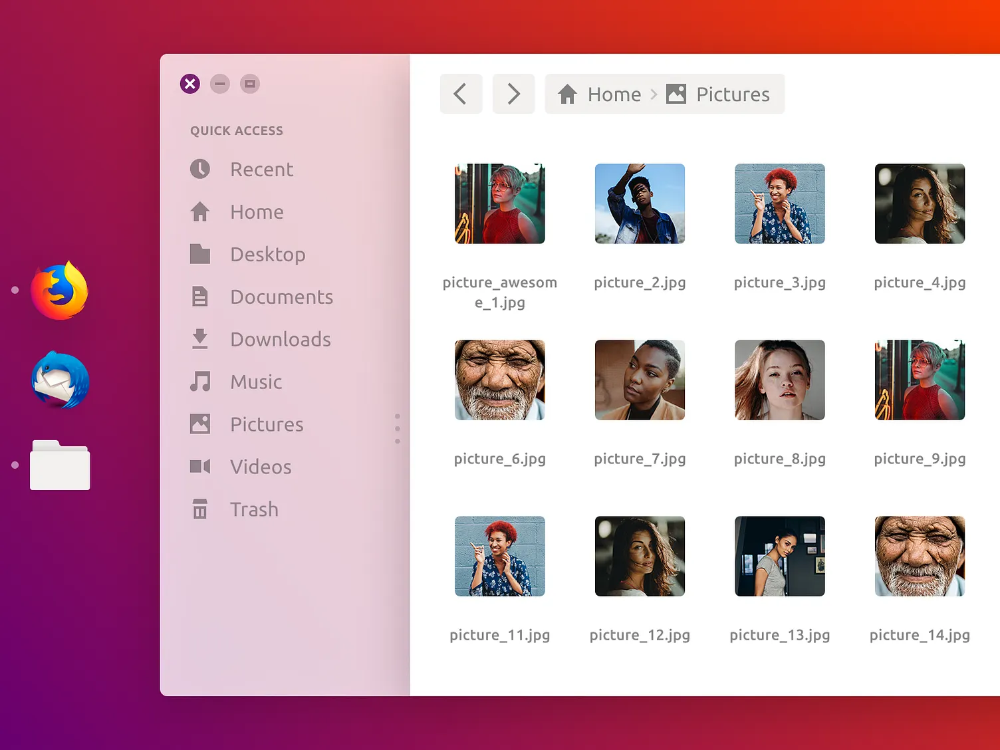

# i9x — a server control panel that looks like a desktop

> i9x turns any Linux server into a browser desktop you actually administer
> from: draggable windows over a real bash PTY, a file manager and editor,
> Docker app deploys straight from Git, managed Postgres, MySQL, Redis, Mongo
> and ClickHouse, full nginx vhost editing with TLS, cron jobs, disk guard and
> scoped API tokens. One .deb, one binary, no agent.

[](https://github.com/1337-Morocco/i9x/actions/workflows/ci.yml)
[](LICENSE)



A browser **desktop environment** (React) driving the **real host machine**:
draggable windows, a dock, and every service as an app.

- 🖳 **Terminal** — a real `bash` PTY. `ls`, `vim`, `top`, colors, tab-completion.
- 📁 **Files** — a real file manager: browse the machine, open/create/rename/delete.
- 📝 **Text Editor** — opens real files, edits, saves to disk (Ctrl+S).

See [docs/architecture.md](docs/architecture.md) for how it fits together.

## Platform features

- **Databases** — managed PostgreSQL, MySQL, MariaDB, Redis, Valkey, MongoDB and
  ClickHouse. One container + one named volume per instance, held in
  "provisioning" until the engine actually answers. SQL engines get a table
  browser and query editor; Redis/Valkey/MongoDB get a console. Logical dumps
  download straight from the card. Adding an engine is one entry in
  `backend/src/dbengines.js` — image, ports, env, readiness probe, dump command.
- **API tokens + `/api/v1`** — bearer tokens (`i9x_<id>_<secret>`, stored hashed)
  with `read`/`write` scopes, accepted anywhere a session is. `/api/v1` is the
  stable surface for CI; `GET /api/openapi.json` describes it.

  ```bash
  curl -X POST -H "Authorization: Bearer i9x_1_…" \
    https://panel.example.com/api/v1/apps/my-app/deploy
  ```

  Tokens can't open a shell (`/ws` needs a session) and can't mint more tokens.
- **Scheduled tasks** — cron jobs run inside an app or database container, any
  container, or on the host, with a timeout and a stored run history. The cron
  parser is `backend/src/cron.js`; one in-process ticker (`scheduler.js`) drives
  everything periodic.
- **Cleanup & disk guard** — scheduled `docker prune` (containers, dangling
  images, build cache, networks; volumes strictly opt-in) plus build-log
  trimming, each run reporting what it reclaimed. Disk usage is checked every
  5 minutes and can auto-clean above a threshold.
- **Storage** — per-app Docker volumes, host binds, and config *files* edited in
  the panel: the body lives in the DB, is materialised under
  `/var/lib/i9x/mounts/<app>/` and bind-mounted into the container, so it
  survives rebuilds.
- **Resource limits** — CPU and memory caps per app, applied live with
  `docker update` (clearing a cap recreates the container from its stored config,
  no rebuild).
- **Full nginx configuration** — every reverse-proxy setting for a domain is
  edited in the panel and rendered to a vhost by `backend/src/nginxconf.js`:
  backends and balancing, path rules (proxy / static files / redirect / fixed
  response), HTTPS redirect + HSTS + protocols + HTTP/2, request size, timeouts
  and buffering, forwarded and custom headers, trusted proxies, basic auth,
  IP allow/deny, security headers, gzip, static and response caching, per-IP rate
  limits, per-domain logs, and raw nginx snippets. The panel shows the exact
  generated config, and `nginx -t` runs before anything is kept — a rejected
  config is rolled back to the previous file, so a bad edit can't take the other
  domains down. i9x also owns the TLS block itself now (certbot only issues
  the certificate), so regenerating a vhost never loses HTTPS.

## Install

On a Debian-family server (Debian, Ubuntu, Mint, Pop!_OS):

```bash
curl -fsSL https://raw.githubusercontent.com/1337-Morocco/i9x/main/packaging/get.sh | sudo bash
```

That pulls the newest `.deb` from [releases](https://github.com/1337-Morocco/i9x/releases),
installs Docker + Compose, nginx and certbot, starts the service, and exposes the
panel on `:5633` over self-signed HTTPS. First visit creates your admin account.

```bash
… | sudo bash -s -- --no-expose          # install only, stay on localhost:3001
… | sudo bash -s -- --port 8443          # different public port
… | sudo bash -s -- --version v2.0.0     # pin a release
```

⚠️ Without `--no-expose` this puts a **root control panel on the public internet**.
Use a long admin password, and prefer restricting it to your own IP:
`sudo ufw allow from <your.ip> to any port 5633 proto tcp`.

Upgrades come from the same release channel — `sudo i9x-update`, or the Updates
panel in Settings.

## Development

```bash
nvm use && npm ci      # one install for both workspaces
npm run dev            # frontend on :5173
npm run dev:backend    # backend on :3001
npm run check          # typecheck + lint + test — what CI runs
```

## Documentation

| | |
|---|---|
| [Architecture](docs/architecture.md) | how the pieces fit, where state lives, why no native modules |
| [Development](docs/development.md) | setup, tests, packaging, releasing |
| [Deployment](docs/deployment.md) | install, update channel, publishing a release |
| [Contributing](CONTRIBUTING.md) | what to know before a pull request |
| [Security](SECURITY.md) | threat model and how to report a vulnerability |

## ⚠️ Security

The backend gives **full shell access to this machine** as whoever runs it, and
the panel is a root control panel by design. It binds to `127.0.0.1` by default;
the installer can front it with TLS on a public port, which is opt-out.

If you expose it, use a long admin password and restrict it by source address.
See [SECURITY.md](SECURITY.md) for the full threat model.

## Roadmap / next steps

- Scheduled database backups to S3 (the dump commands already exist per engine)
- Deploy notifications (Discord/Telegram/email) on build failure, container exit,
  cert expiry, disk alerts
- Health-gated, zero-downtime deploys + rollback to a previous image
- Proper window-resize (swap the `script` PTY for `node-pty` — needs
  `sudo apt install build-essential`; unlocks clean SIGWINCH/resize)
- Multiple tabs / sessions, reconnect handling
- Optional sandboxing (run the shell in a container/namespace per user)
